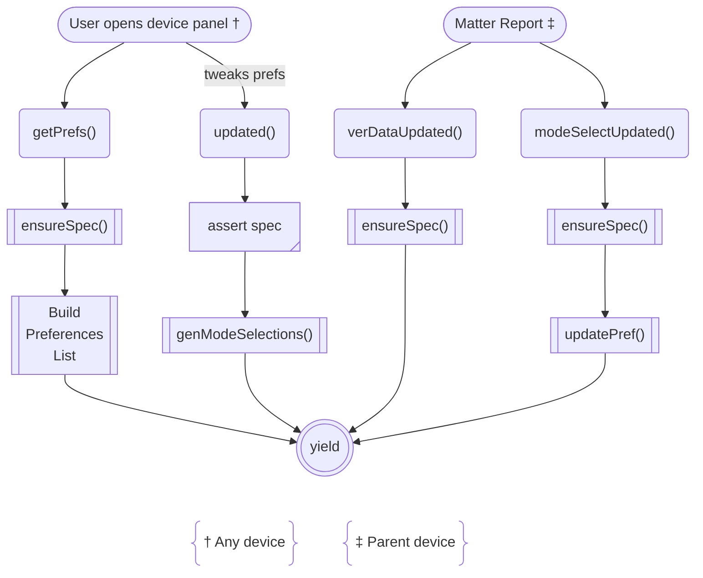
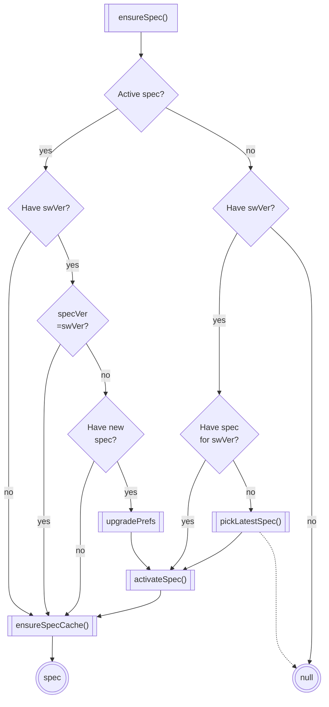
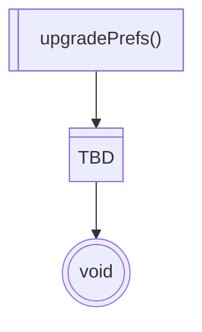
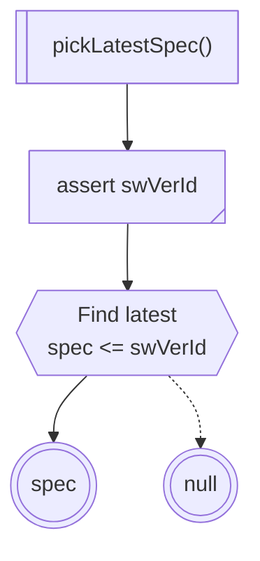
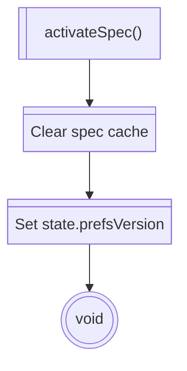
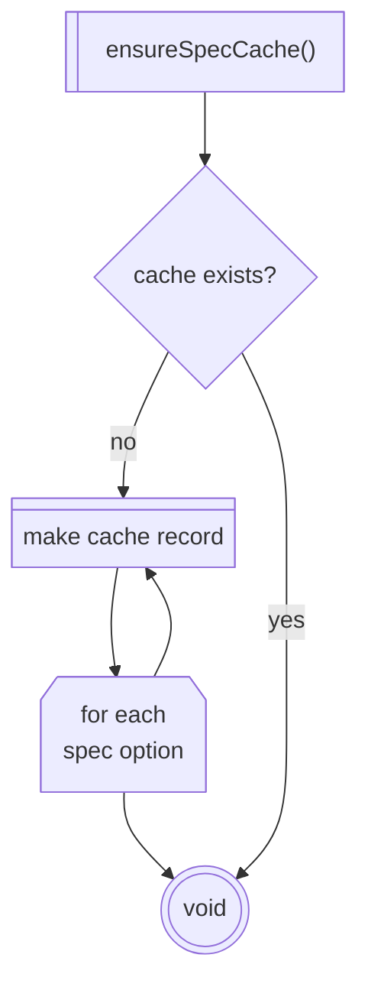

# Mode Selection Flow



[](https://mermaid.ai/live/edit#pako:eNp9U9tO4zAQ_RVrJFZFSqvm0lu0Qnvp41ZCS3iB9MFNpmlEEke2A8uWVnwK_BpfsuOkJF12IVIkz_icOTPH9hYiESP4sM7EXbThUrNgHhaMvpMTFgy_bNWGl-gzpWlv1-wEV3abj0W1yrAfpTLK0GIZX2Hms_sUs5jQDb5Ke9chXCqUTJRYKBbjbRohK3mBGXt5fAphecr6_TMW2K8MEz7oO-Q3ipUS1-qBBc5B3u6FkKA-N-neaQgNlwpXEi9KjOxrkutCA1kua8yqSrO45hnINxN9Xskzk0GJRYTKhD9SpVsKDXuQdUi2KmOuMe5UuaKxtJFpLdE86UuMdOtGCA2KKYKFsKuJCRYLsv4CM4Kmoqg7-id51HvdSNNKzrVGaUxd1Cv2E0tB9V8enzsrXfaJBd6hd5d6v0U555pfvh2hc8p5x7i_bPCoVN42-UE1991jaFw0rhtIF_1_Wlqy_X7Pou7WrSSnszoymC4R-1rcH24WefyG6nxEfWbnnE5fH7PBgkSmMfhaVmhBjjLnJoStqRyC3mBOSFMg5vImhLDYEYeu9JUQ-StNiirZgL_mmaKoGXSe8kTyvM2Scozyu6gKDf7Im9VFwN_CL_An48F4OvFm9swbumP6LbgH3_acgetM3ZE3Gc2c6cxzdxb8rmWHg-lkZAHGqRZy0Tzt-oXv_gDSoUGc)

# ensureSpec()


[](https://mermaid.ai/live/edit#pako:eNqFVFuPk0AU_ivkPGkCDcWybYmumt0YH9RsovHBZR-mw2khHWbIMGzdpf3vzqVQlqDyNHPOdzkXoAUqMoQEtkwcaE6k8n7cptzTj3r-1jD2oa1zUmHiZaLZMAxoISlD32NkgyzxUuAalMKp43yvkP6XU2uQ5ThWwR_FHnsWK3ggkaoBAXndSDTar173ZoSq4tEG2xQ-2otnlN_3iJzo_OEnyrlGfCYmb24TgOgvgJIommPdupp16u1GXr-bUtHpT0IOvTgeDHqipB57sdUhA94KOSxhOB8vCK4HPY9nYNPHJ6yPg7bHY3AgLo4eJaav6bwVOXf-Ygw63eedwP39cDk3JmY29PAw5p1tR6P6Rz1jkDVtqp0kGRrX8_FO4rY2hpfxEIXj7Q4LH21goN6xjXx37t65s4Er0x7duz651UtbTEvUyghWBd1_sbeR5Muaxwvth9b3EQR9wn2ijuicvJmtzIXBh50sMkiUbNCHEmVJzBVaQ0lB5VhiCuYDy4jcp5Dyk-ZUhP8SouxoUjS7HJItYbW-NVWmjW4Loqdf9lGJPEN5IxquIImjlRWBpIXfkLyJ57N5uFyHq8XVcrFexT48QbKMZ8s4DMMoCq-icL2ITj48W9dwtlpqDGaFEvKr-zvZn9TpD6Hoiw8)

# upgradePrefs()



[](https://mermaid.ai/live/edit#pako:eNpV0UFrwyAUB_CvEt5pg6QYbVLxMMbW62CHssPwYuNrIzUarOm2hnz3mZaVztuT_-8v8kZovEYQsLP-q2lViNlmLV2WjnEnf8Dn8diqHkVmjSsCNjHPrNqiFZmEod8HpfE94O748Chhyori6YrjVt-kNqeiD765k5uX9f_4-cObO-GHrcWiMaGxeMdOKZScdJDDPhgNIoYBc-gwdGoeYZz7JMQWO5QwG63CQYJ0UzK9cp_ed38s-GHfgtgpe0zT0GsVcW1U-lR3uw3oNIZXP7gIoqQlKy81IEb4BkEJW1SEME7ZijBKa5bDz5yjixUtCSs5r0rO-JTD-fIwWdRLVvNlzSvKCK2qVIfaRB_ernu4rGP6BVnQfq8)

# pickLatestSpec()



[](https://mermaid.ai/live/edit#pako:eNqFklFrgzAQgP9KuKcNtGhSnUhXBiuDwbaXjT0MX1JzrdKYSIxrV-l_X9S1tH1Z3i5333d3IR3kWiCksJJ6mxfcWPKxyBRxx-7fWikfuqbgNaZE6HYp0c9Lk0v0iORLlCnJQLmiDA5H5r3G_F-mcUUDM1Kl-tYbPFGyVL7B3J4BdZlvXrjFxvb-m1sHE9-fjzhvGjT2orHl62vFWEWa7SeaZ3ESjIq80LrBC0WBuzP6qVTCRf0Es6WZ9wuQ2f2V7W_9ayWZDKn-NTMFHqxNKSC1pkUPKjQV70PoeiwDW2CFGfQ9BTebDDJ1cEzN1ZfW1REzul0XkK64bFzU1sJNtij52vDqdGtQCTSPulUW0pANDkg72EFKAzaJgoAllN0FjNLYZX9cEaWTOxoGLEySKExYcvBgP3QNJvGUxck0TiLKAhpFoQcoSqvN6_h9hl90-AVSj75E)

# activateSpec()


[](https://mermaid.ai/live/edit#pako:eNp9kbFugzAQhl_FuqmVIAI7EOShqpSsnVJlqFgc-xKsgI2MoW0Q716TqE2y1NtZ__fdL90I0ioEDofafspKOE_eN6Uh4Wkz2BO-jl0lWuSk1iZ2KH1EarHHmpMShPR6EB63Lcqn5xImEscvV1jWKNxayOomUHqIW2flnWA9p0gXcCLn7IOi86Jp_6O36OeQx0Xr8NDt0HXamgeHP--sVjeJ7fc1xlK70O_ONIRQ4EoDERydVsC96zGCBl0j5hHG2VeCr7AJLWdGCXcqoTRTYFphPqxtfjFn-2MF_CDqLkx9q0LHjRZHJ5q_X4dGoVvb3njg6eriAD7CF3CasEWWJKygbJUwSnMWwXcIUbpY0TRhaVFkacGKKYLzZWuyyJcsL5Z5kVGW0CxLI0ClvXVv1-Nebjz9ANYdnNE)

# ensureSpecCache()



[](https://mermaid.ai/live/edit#pako:eNpVks1uqzAQhV_FmlWvBBHYhSBU9V6pvcuuWnVReeOYSbACHmRM-kPz7jUhTakXlmbmzDdnpBlBU4VQwrahV10r59nTvbQsPGMPtMd_Y1-rDkvWGBs71D5ijdpgUzIJaPvB4WOH-k7pGq_-SDiyOL6d-_HN9L4fJeipeA7_niXsk1kKXyCSqy5DKnOIO0d6MaRVe2QzYhb_GrIl9z_UflwSdXFjWrP0GUQMg-pm42774JZR5w3Zbytn7JJ3yvuPZzILbzRsGoy1cbrBBf0QRAG1XHre8B37zzNEWohg50wFpXcDRtCia9UUwjg1SvA1tihhAlbK7SVIeww9nbIvRO13m6NhV0O5VU0foqGrlMd7o3ZOtZesQ1uhu6PBeihTnuTrEwbKEd6g5IlYZUkiCi7WieA8FxG8Tzq-WvM0EWlRZGkhimMEH6fBySq_FnlxnRcZFwnPsjQCrIwn9zBfzumAjl-IILuZ)

```groovy
// Key is an endpoint-number (type: uint16 per "Matter Specification R1.4" § 7.19.2)
// Groovy doesn't support unsigned types, so we use low 16 bits of 32-bit Integer.
Map<Integer, Object> cacheEntry = [
    20: <last device-reported value>,
    ...
]
```
