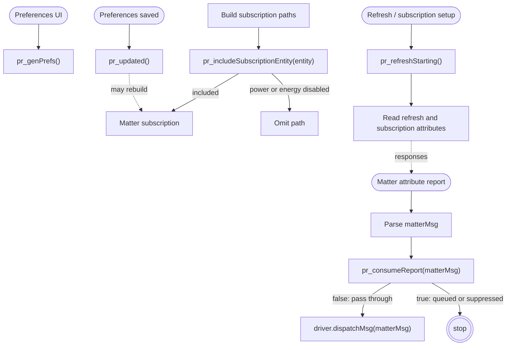
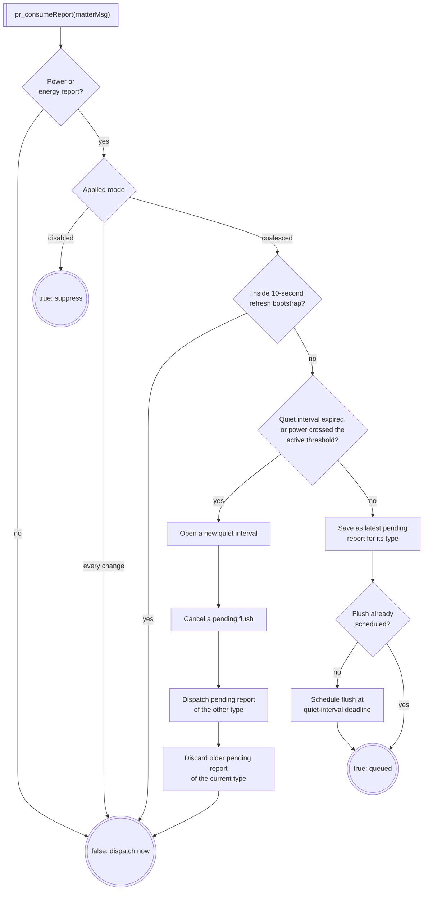
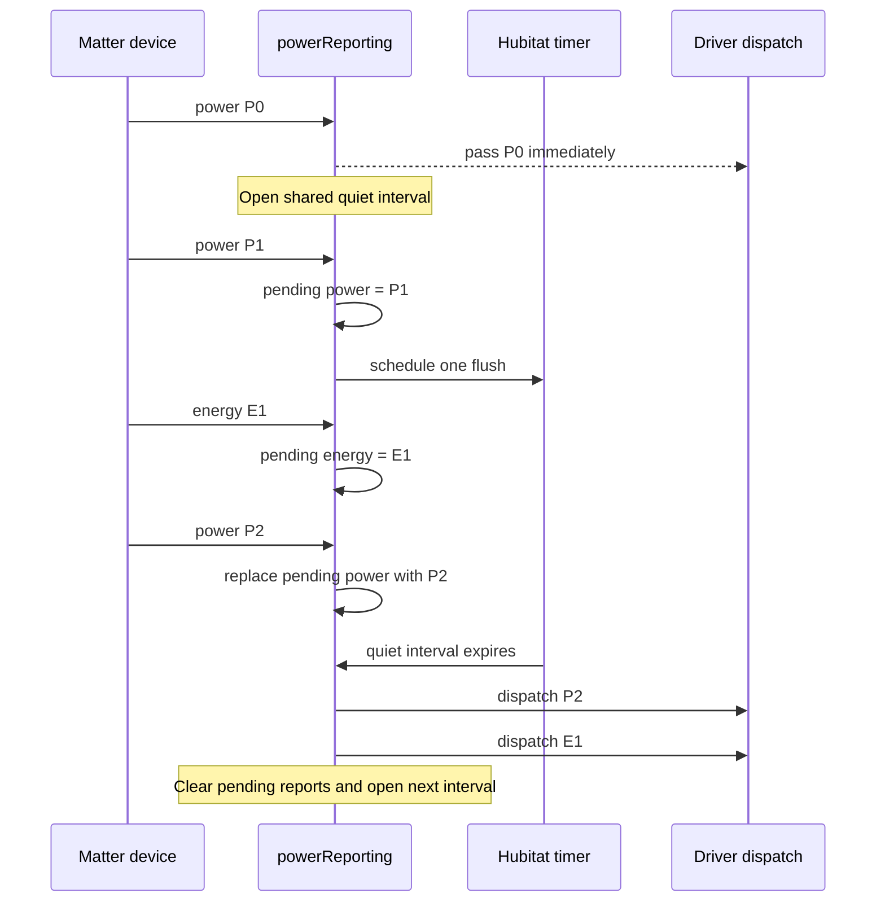
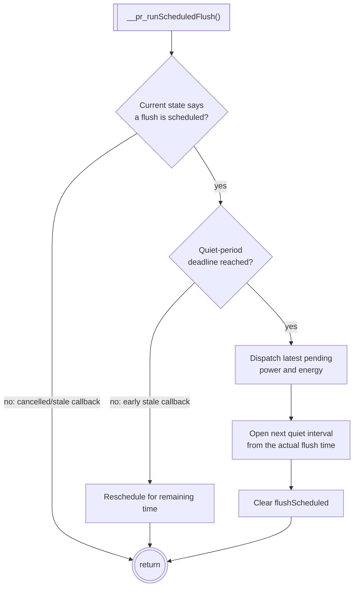
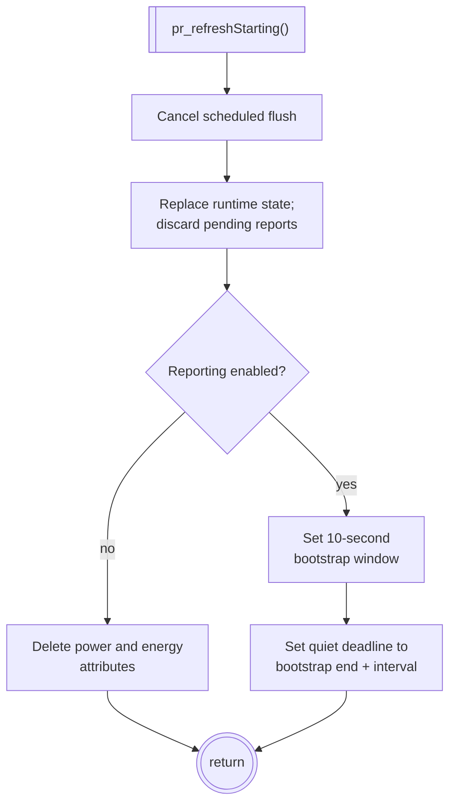
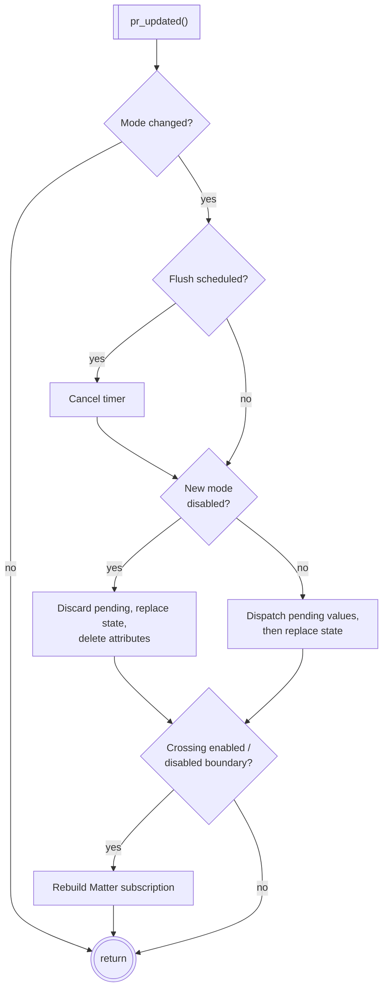

# Power Reporting Design

The `powerReporting` library controls whether Matter power and energy attribute reports become Hubitat events immediately, are reduced to the latest value over a quiet interval, or are suppressed altogether. It sits between Matter message parsing and the host driver's normal `dispatchMsg` path.

The library recognizes exactly two reports:

| Hubitat attribute | Matter cluster | Matter attribute |
| --- | ---: | ---: |
| `power` | `0x0090` | `0x0008` |
| `energy` | `0x0091` | `0x0001` |

All other Matter reports pass through unchanged.

## Driver integration


[](https://mermaid.ai/live/edit#pako:eNqFlF1v0zAUhv-K5atOSsPWdv3IBUIwkLiomDa4gSDkxqeJRWIbf2yUtv-dY-dj2SREpdSx_Z7n-Lw5yZEWigPN6L5Wj0XFjCOfb3JJ8KcN7O3kW05v8QYMyAIs-fIxp98vyHT6mpQgw45FhTY_-tnkAgUtwLIHeBkf1viA8JozB7wldJMRAOMM2Cow7tpb8opYv7OFEdoJJYkF5_WA6_T3DstomeMVIcuO3R3P7956UYfscXxO1sxVFtURjDsfRO3AtFQhi9pzuB_p30sn3GECcRhZ0AcGzKmL46c-1Q4QuGUuCMbZ_xGv1SPeKUNAgikPhAvLdnXgqUaEij_hEE8-KtOAVsZNnhLhP2b2DrqtwT7NjA0Hug0jaaJ6a8vhMHE_KgslrW-gdaOb3LV5hrAnEzpBLGHPagsZoqwlrjLKl9Up1IGHLirkcSMewKT9CnL-R3TGI_CXBw88eGO9xs61NtrslH5ztBXTKOHKo1nTQpiihoTUbAd1RnIaRDk99351bUimKVpwQI92sTnStg3ap_asPWNzdf3HeOxVxvtNwuSLxhrst6M-ZzEfBmisDF-TNNLi05E0oaURnGah0oQ2YBoWpvQYonPqKmggp6EUzszPnObyjDGaya9KNX1YtJpm0f-EtkXeCFYa1gyr-I5yMO-Ul45mV8vIoNmR_qbZapku16vF5mqzuJwv8UroATWLWTqfrefXi9X1ZrbeLObnhP6JWS_T9eo6ocCFU2bbfmPip-b8Fxt4hGo)

The host driver has five integration responsibilities:

1. Include `pr_genPrefs()` in its preference definitions.
2. Call `pr_updated()` while processing saved preferences.
3. Pass `pr_includeSubscriptionEntity` when constructing normal subscription paths.
4. Call `pr_refreshStarting()` before issuing refresh reads.
5. Call `pr_consumeReport()` before normal attribute dispatch, and stop processing when it returns `true`.

The driver exposes `dispatchMsg` and `resubscribe` callbacks through `getApi().driver`. The library uses the former to release delayed reports back into the normal event path and the latter when enabling or disabling reporting changes the required subscription paths.

## Reporting modes

The `powerMonitoring` preference value is both the mode selector and, for coalesced modes, the interval in seconds.

| Value | Behavior |
| ---: | --- |
| `0` | Disable reporting: omit power and energy subscription paths, suppress any in-flight reports, and delete both attributes. |
| `1` | Report every change: pass every power and energy report directly to the driver. |
| `300`, `900`, `1800`, `3600` | Coalesce changes over a shared 5-, 15-, 30-, or 60-minute quiet interval. |

The applied mode is cached in the per-device runtime record. This makes report and subscription decisions use the last mode applied under the device lock rather than a preference value that may be changing concurrently.

## Report admission and coalescing


[](https://mermaid.ai/live/edit#pako:eNqNVGFv2jAQ_SuWP21SqNpCC0RTt6nVpH2ouq37tGWajH2QqMZ2zw6UAf99Z6ckwFZtSBGx796753fnrLm0CnjOp9ouZSkwsK83hWH0q8zCPsC7tS-Fg5zpyvQQZMiYFhPQOSu4w5_SGl_P4Qs4i-HVXIQAeOtnrwu-bVikFt5X0wrUuuCf7BKQWXwzwSswgLMVw4R82-bPSQ5lvndOEyYt29jE2uADCkcJH42vFLCz054HEqEiJcIUwZddXkc7WTnSQbjPdQWBzkY6F0IzeHIVgsoi3CJzSaBE6z0VDyXEfSFDtQBaRXKrVcO6bxLr9a72Tnp88hjeGLthUUNrqLL1RENPVig17Lk6FdrHcOWdCLJkxi7_4mbiXIHfNBa13qV9wgriVhvma-dI9r-rBqwpuks_aEeihAXgitGEmBk0BzlKkFZo8DIWbf0_alunucMfBqNJTat2BjerDmkdmO8Fv6M_JpiBJXs86GjBfzTAmNj0RRgJmjDX6YVQFFGVmbGprn3ZApq8BEHQIDzc0QAgAW92rdgBm6FNMzONU8JszGRh5aCl2-dIpNQUKVDdizk0nHHFaJ4o_iKxrBHBhEPqPabE_IJf0Uwi1ELGgveCZlh46ngAH3YVm2sTi7IpzX8V_PEpEj6V8bIEVet0kz9E65jQCEKtIkkb7O5cu9Wq2e1EOc-vTROYSIdOrey1l1MROX12OjWHjGkeHmuoQf3neDfJfwhMp3uOGZ7xGVaK5xGS8TngXMQlX0cQMZUwJ0WRVAl8KHhhtoRxwnyzdr6Doa1nJc_TXc547RS5flOJGYouhToAeG1rE3g-Tgw8X_Mnng8vTy5Hw8H4bDw47V_Sk_EVz88G5yf981H_YjC8GJ-PxoP-NuO_Us3Tk9HwIuOgqmDxtvmgp-_69jcyowSo)

Power and energy share one quiet-period deadline. The first admitted report opens the interval. During the interval, the library retains at most one pending power report and one pending energy report; a later report of the same type replaces the earlier one. This bounds queued state while preserving the newest observation of each type.

At a quiet-period boundary, the newly arrived report is kept as the authoritative value for its type. Any pending report of the other type is dispatched first, while an older pending report of the same type is discarded. The new report then returns to the host driver for ordinary dispatch.

### Active/inactive transitions

Coalescing must not hide a load turning on or off. For power reports, the library compares the incoming milliwatt value with the power value currently exposed by the device (converted from watts back to milliwatts). Values at or above `23 mW` are treated as active; lower or absent values are inactive.

If the classifications differ, the incoming power report bypasses an open quiet interval and starts a new one. Pending energy is dispatched, pending older power is discarded, and the transition is dispatched immediately. Thus fast on/off changes remain observable even in a 60-minute coalescing mode.

## Coalescing timeline


[](https://mermaid.ai/live/edit#pako:eNptU8tu6jAQ_RVr1ikCEl6R2k2p1A33oopVlY0bTxPrJnY6digU8e-dJMAlpZYixWfOzJmXD5BahRCDw48aTYpLLTOSZWIEn0qS16mupPFiJaQTK-k9klC41SnectYNp7KfSC9YWcZNdkvaNKTn-k176YXXJdItZ9lwlqS3jZh2lfRpnpiOt7p7eFjHnYxYDztwfcfoklHpHINClyUqLT0W-47wx3oUtonHvn8rNMLlklCJj1qjF9pwXVtZ_C4yOot0IBrFlZ2M9z3zJhYuzVHVBasZFO9F7X5mjgYp24un36OerPcXez-Vcc-JsCpkij9S-tQ-b5kdd9Nx-4UK3FWa0P0Px907t7onc42fc-p187FASZcUqJ28E9IoYZs-G9xd9xcCyEgriD3VGACPv5TNFQ5N6AR8jiUmEPOvkvQvgcQc2YfX4tXa8uxGts5yiN9l4fhWV4pHfVrdC0qcEdKjrY2HeBS2MSA-wA7i2XQwnc-ixWgRDcMpfwHsmRONB-F4Hk6i2WQxni-i8BjAV6s6HMxnk-HVGQXAC-Ytrbr30z6j4zfwMQwl)

Only the first queued report schedules a callback. Subsequent reports update the pending slots without adding timers.

## Scheduled flush behavior


[](https://mermaid.ai/live/edit#pako:eNptk1uP0zAQhf_KyE8gpWW390ZoQWrFG0JcniCocu1pY61jh4nNtrT974yTbUSBSFHi2Oc7Z8bxSSivUeRiZ_2TKiUF-LIuHPClpLVbqR7fnppS1piDNW5AqEIGVm7R5lCIzaamDUX3WZWoo0X9zsamfPGyEJcOgoeaFahPhVhFInQBmiADQiOPzestPUjYJQmYBpor5E0v1yg12yLLP0aDYVAjGa-T8DoFhDIJO9FtdBgMHvoIt4HS1Nn5nNc6hZZdX3Ewi732DNo77IvXPm4tDpQhZfGPDhCGSO6felv8EZtzX8JtQb09SrJH-Nua8NqMb4X41A9g54nnKmmccXsIpsJCfG-rTGH_Y9FGaDvMoLVpahlUyekDNgFqdJo5qZu1f0IC6TSgQ9ofGdvRut1JDg4PgSEfWNW-w4-0I2BcQPopbaLsyFcQSgSpQpT2Wfwcs-O1yoTjNkpi3io9u5X9X3RblMjEnowWeaCImaiQuAE8FKeELAQbJoO0G1rSYyEKd2FNLd1X76urjHzclyLfSdvwKNaae7A2ck-y6r_y_6mRVj66IPL7ecsQ-UkcRD6fDWeL-WR5v5zcjWd8Z-LIayaj4Xi0GE8n8-lytFhOxpdM_Gpd74aL-TQTqE3w9L47ZO1Zu_wGYv4qyQ)

Hubitat may deliver a callback after it was cancelled. It may also deliver an old callback while a replacement timer is active. The `flushScheduled` flag rejects the former, and checking the current deadline reschedules the latter rather than releasing values early. These checks prevent callbacks from an earlier state generation from publishing stale data.

## Refresh bootstrap


[](https://mermaid.ai/live/edit#pako:eNpVU9uOmzAQ_RVrnroqRLmQG1ttK21e-9LtU0tVGXsC1hqbjk3SlOTf10BCtkig8TDnHM8ZuwVhJUIKe22PouTk2fddZlh4lDnYV_zSupLXmDKtTEwofMQ0z1GnLIOafhPuCV354gNSmeLDQwaXAS64Eah_ZvDcB8yJEmWjUbK9blyZwa-hjrDWXGAo_DZEjBrjVYXMee7x8VNOT1I5wUmyGo0MKh3GkncjRxV6aHsC22-DoeF5kPo87oawsodOZIcaPbLaHpEYNzKUIhWnToV7TypvPN6Jc2u988TrgHxBz2bT2KGwRnb14092VEba44iSyGWwC6-gP40K31uSefs_OPTEPga3PdKB657k_QBYHD9dzezDq1993PV9d6BLnY09X5vtK6Q19xFK2wRXYqFIaHw3R0LfkBm9GrlO6M53Cwa-Wxc38sxABAUpCamnBiOokCreLaHt6DLwJVaYQSckOb1mkJlLwNTc_LC2usHINkUJ6Z5rF1ZNLcPsd4oXxKsxS8EqpGcbzgek86TngLSFv5CuV5PVZp1sZ9tkuliFN4ITpLNkPlnMN4tlsl5u55ttsrhE8K9XnU4262UEKJW39HW4A_1VuLwBZdIGqw)

Refresh deliberately discards queued values so a pre-refresh observation cannot overwrite the values returned by the new reads. For ten seconds after refresh begins, recognized reports pass through immediately. This allows both refresh responses and initial subscription reports to repopulate power and energy attributes promptly.

The next quiet interval is anchored at the end of bootstrap, not at the first bootstrap report. Repeating Refresh resets state and extends both the bootstrap window and its following quiet interval.

## Preference transitions and subscriptions


[](https://mermaid.ai/live/edit#pako:eNptU9tu2zAM_RWBTxvgZG2ujjF0AxrsLXsY9rR5GGSJjYXKkqFLsyzJv4--5bLWgAHS5DniObQOIKxEyOBJ250ouQvs-zo3jB5lXuwzfj74kteYMa3MyKEICdO8QJ2xHGr3O9aSB5Tv3udw6mBEYrYoDzlsiHlIP53rNRqpzJbqX3T0JfOiRBn1dYvBXYOllq-4YxWFHwv3IJXnxU2fcNb7juuxDxmatol9uIawwkYjudt32Gt9bDR6GIa8EdAUjsYembTm4oK0kQhHQjmh8coKhyE6878JLcce_XFQfWPBpSq4Eah_kow2YEFV6HL41Q7Xu_Ea2gx3U-yTCy_pF9xJIl530YBPmMNac4HMB9pf0pqFGgMyHoJTRQzoaYDXvM2hjjq5x4625kGU57leuI7oW75Qork95kzYz9V532-uq_TUb1SG7KLOoY-FFzRtM8o3LKLSkm1IADrWl-qgrBmcbDb5Btmw5NxAAlunJGTBRUyAllDxJoVDA8uBJFWkolk4_U3POeTmRJiamx_WVgPM2bgtIXvi2lPW3ZC14lvHq_NXR36he6TfMkA2SVsOyA7wB7LlYrxIl7PV_Wp2N13Qm8AesvvZZDydpNP5bDlfTdLVbHpK4G976t04Xc4TQKmCdZvuOre3-vQPvItMBA)

Changing between enabled modes does not require a new Matter subscription because the subscribed paths are unchanged. If values are pending, they are dispatched before the new timing state takes effect. Changing to disabled discards pending values and removes the attributes. Crossing either direction between disabled and enabled triggers subscription replacement because the power and energy paths must be removed or restored.

`pr_includeSubscriptionEntity()` only filters the two recognized attribute paths, and only while disabled. Unrelated attributes and all event paths remain included. A development full-attribute scan intentionally bypasses this filter; `pr_consumeReport()` still suppresses power and energy reports in disabled mode so they cannot recreate the deleted attributes.

## Per-device runtime state

State is held in a static map keyed by device network ID (DNI), with a separate per-DNI lock:

```groovy
[
    appliedReportingMode: Integer, // 0, 1, or coalescing interval in seconds
    refreshBootstrapUntil: long,   // timestamp in milliseconds
    coalescingUntil: long,         // shared power/energy deadline
    flushScheduled: boolean,
    pendingByType: [               // zero, one, or both entries
        power:  <Matter message>,
        energy: <Matter message>,
    ],
]
```

The lock serializes mode changes, refresh resets, report admission, and timer callbacks for one device without coupling different devices. State replacement is preferred for lifecycle resets. This lets late callbacks observe either an explicitly inactive replacement record or its current deadline rather than mutate an obsolete collection of pending reports.

## Behavioral invariants

- Disabled mode never dispatches recognized power or energy reports.
- Every-change mode never queues recognized reports.
- Coalesced mode keeps no more than one pending report per type and one scheduled flush per device.
- Power and energy use a shared interval, but their latest pending values are tracked independently.
- An admitted report is never followed by dispatch of an older pending report of the same type.
- Active/inactive power changes and refresh bootstrap reports are immediate.
- Refresh and disabling reporting discard pending data; enabled-to-enabled mode changes dispatch it.
- A cancelled or early stale callback cannot flush a replacement state's data before its current deadline.

Admission and final host dispatch are separate operations. A report can pass admission immediately before Refresh acquires the library lock and finish dispatching after the reset begins. The design therefore guarantees eventual convergence after refresh and protection from cached/timer-based stale overwrites, not atomic ordering of every concurrently arriving physical report.
